# INTRUSION DETECTION PREDICTION

_Predicting the type of Cyber attack based on Network Packets (Intrusion) using Machine Learning models_
<br><br><br>

### 🌟 EXPERIENCE HERE 🌟

https://huggingface.co/spaces/raghavavidyapriya/ids-prediction
<br><br><br>

### PROTOTYPE VIDEO


https://github.com/user-attachments/assets/b53613c2-1bec-4cb4-8eec-d0cbc46efde6


<br><br>

### HOW TO EXECUTE

#### Terminal

```
git clone https://github.com/raghavavidyapriya/ids-prediction.git
```

<br>

```
cd ids-prediction/
```

<br>

```
pip install -r requirements.txt
```

<br>

```
cd gradio/
```

<br>

```
gradio ids_ml_gradio.py
```

<br>

#### Web Browser

```
http://127.0.0.1:7860/
```

<br>

### PROBLEM

A firewall alone doesn’t provide adequate protection against modern cyber threats. Malware and other malicious content are often delivered using legitimate types of traffic, such as email, or web traffic. In order to solve this problem we need to step in further and examine the network traffic, this is where the Intrusion Detection System plays a major role.
<br><br><br>

### WHAT IS IDS?

An Intrusion Detection System (IDS) is a network security technology originally built for detecting vulnerability exploits against a target application or computer. The IDS is a listen-only device. The IDS monitors traffic and reports results to an administrator.
<br><br><br>

### WORKING OF IDS

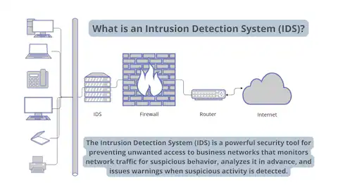

Typical intrusion detection systems look for known attack, Signature-based IDS monitors inbound network traffic, looking for specific patterns and sequences that match known attack signatures or abnormal deviations from set norms. These anomalous patterns in the network traffic are then sent up in the stack for further investigation at the protocol and application layers of the OSI (Open Systems Interconnection) model.<br>
<br> An IDS is placed out of the real-time communication band (a path between the information sender and receiver) within your network infrastructure to work as a detection system. It instead leverages a SPAN or TAP port for network monitoring and analyzes a copy of inline network packets (fetched through port mirroring) to make sure the streaming traffic is not malicious or spoofed in any way. The IDS efficiently detects infected elements with the potential to impact your overall network performance, such as malformed information packets, DNS poisonings, port scans and more.<br>
IDS is either installed on your network or a client system (host-based IDS)
<br><br><br>

### OBJECTIVE

To predict the type of cyber attack that could have possibly occurred in a network. Having the past network logs from a server using machine learning models, We have to choose the best suitable model for the prediction. For the new input classify the type of cyber attack that has a higher chance of occurrence.
<br><br><br>

### END USERS

1. Security operations center (SOC) analysts.
2. Incident responders.
3. Cyber Security analysts.
4. A person with adequate knowledge on networking can experiment this.
   <br><br><br>

### OVERVIEW OF INITIAL DATASET

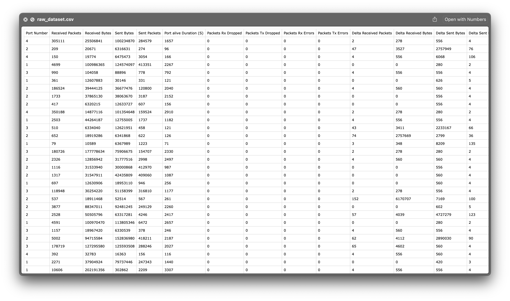

This dataset contains 5000 records of features extracted from Network Port Statistics to protect modern-day computer networks from cyber attacks and are thereby classified into 5 classes. <br>

Switch ID - The switch through which the network flow passed. <br>
Port Number - The switch port through which the flow passed. <br>
Received Packets - Number of packets received by the port. <br>
Received Bytes - Number of bytes received by the port. <br>
Sent Bytes - Number of bytes sent by the port. <br>
Sent Packets - Number of packets sent by the port. <br>
Port alive Duration (S) - The time port has been alive in seconds. <br>
Packets Rx Dropped - Number of packets dropped by the receiver. <br>
Packets Tx Dropped - Number of packets dropped by the sender. <br>
Packets Rx Errors - Number of transmit errors. <br>
Delta Received Packets - Number of packets received by the port. <br>
Delta Received Bytes - Number of bytes received by the port. <br>
Delta Sent Bytes - Number of bytes sent by the port. <br>
Delta Sent Packets - Number of packets sent by the port. <br>
Delta Port alive Duration (S) - The time port has been alive in seconds. <br>
Delta Packets Rx Dropped - Number of packets dropped by the receiver. <br>
Delta Packets Tx Dropped - Number of packets dropped by the sender. <br>
Delta Packets Rx Errors - Number of receive errors. <br>
Delta Packets Tx Errors - Number of transmit errors. <br>
Connection Point - Network connection point expressed as a pair of the network element identifier and port number. <br>
Total Load/Rate - Obtain the current observed total load/rate (in bytes/s) on a link. <br>
Total Load/Latest - Obtain the latest total load bytes counter viewed on that link. <br>
Load/Rate - Obtain the current observed unknown-sized load/rate (in bytes/s) on a link. <br>
Unknown Load/Latest - Obtain the latest unknown-sized load bytes counter viewed on that link. <br>
Latest bytes counter - Latest bytes counted in the switch port. <br>
Checkis*valit - Indicates whether this load was built on valid values. <br>
vpn_keyTable ID - Returns the Table ID values. <br>
Active Flow Entries - Returns the number of active flow entries in this table. <br>
Packets Looked Up - Returns the number of packets looked up in the table. <br>
Packets Matched - Returns the number of packets that successfully matched in the table. <br>
Max Size - Returns the maximum size of this table. <br><br>
\_TARGET* --- Label - Label types for intrusions - Normal:0, Blackhole:1, TCP-SYN:2, PortScan:3, Diversion:4
<br><br><br>

### PREPROCESSING (Techniques)

- Exploratory Data Analysis (EDA) <br>
- Cleaning <br>
- Sampling <br>
- Scaling <br>
- Visualization
  <br><br><br>

### PREPROCESSING (Visualization)

- Heatmap before scaling the columns <br><br>
  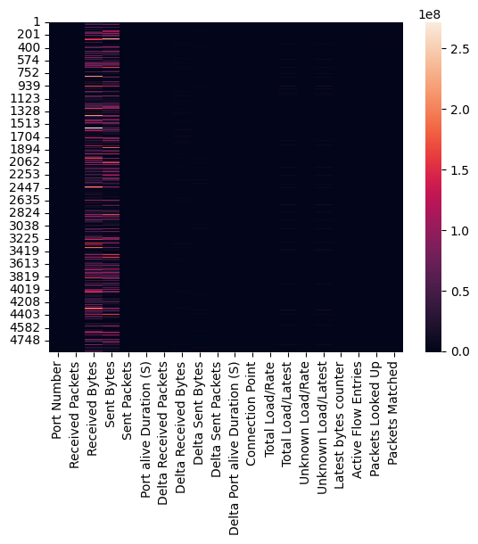

- Heatmap after scaling the columns <br><br>
  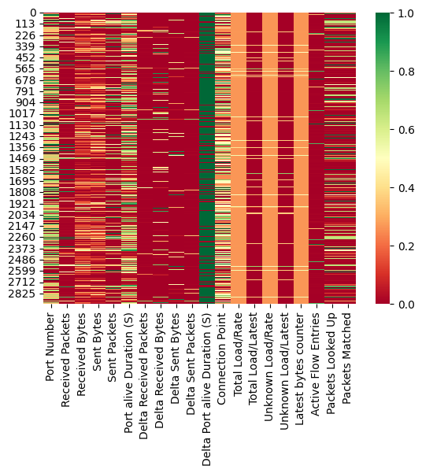

- Heatmap after cleaning <br><br>
  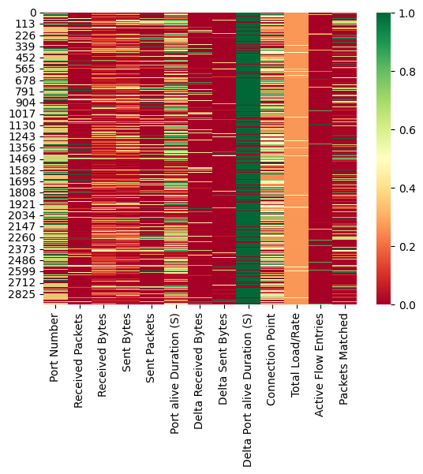

<br><br>

### MACHINE LEARNING MODELS USED

- Naive Bayes <br>
- Random Forest <br>
- XG Boost
  <br><br><br>

### MODEL BUILDING TECHNIQUES USED

- Cross Validation <br>
- Hyper Parameter Tuning
  <br><br><br>

### EVALUATION METRICS USED

- Accuracy <br>
- Confusion Matrix <br>
- Precision <br>
- Recall
  <br><br><br>

### RESULTS (Confusion Matrix)

- Navie Bayes <br><br>
  

- Random Forest <br><br>
  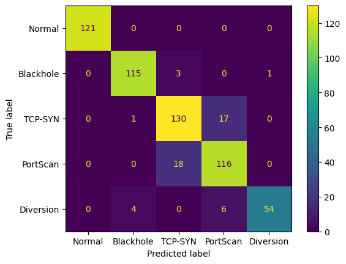

- XG Boost <br><br>
  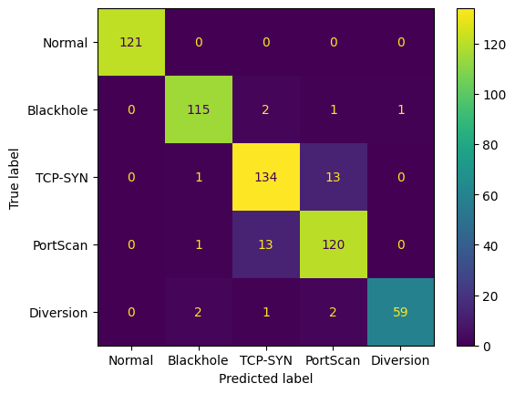

<br><br>

### PERFORMANCE

- Navie Bayes <br><br>
  

- Random Forest <br><br>
  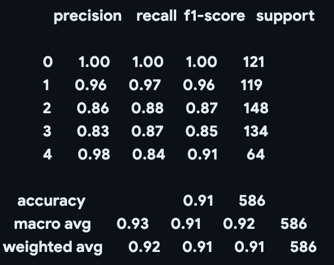

- XG Boost <br><br>
  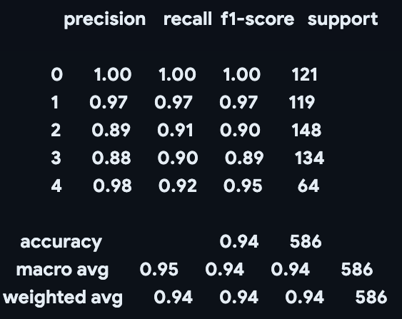

<br><br>

### INFERENCE

Best hyperparameters for XG Boost <br>
gamma: 0 <br>
learning_rate: 0.1 <br>
max_depth: 7 <br>
min_child_weight: 1 <br>
subsample: 0.9 <br><br>
After preprocessing the dataset, Naive Bayes algorithm, Random Forest algorithm, XG Boost had been used for classifying the test dataset. After multiple trials The XG Boost classified the test dataset and resulted in an average of 94 % accuracy, While other algorithms resulted in less accuracy. Since the XG Boost algorithm performed better than other models and because of it's high scalability, robustness and stable performance, It is chosen for the deployment process.
<br><br><br>

### OUTPUTS

- Home Screen <br><br>
  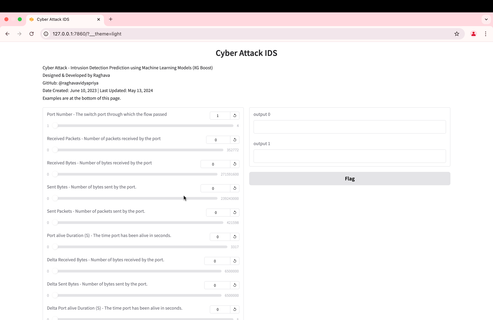

- Predefined Examples <br><br>
  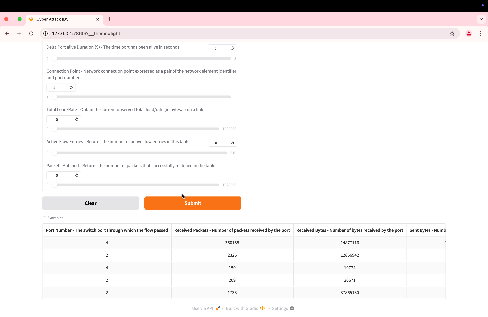

- Prediction Label: NORMAL <br><br>
  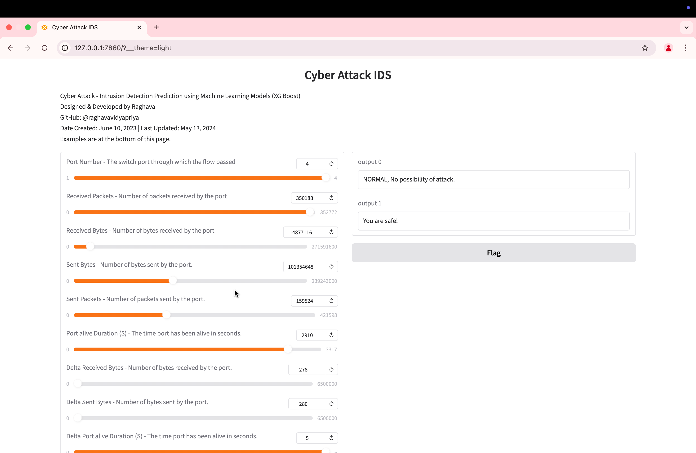

- Prediction Label: BLACKHOLE Attack <br><br>
  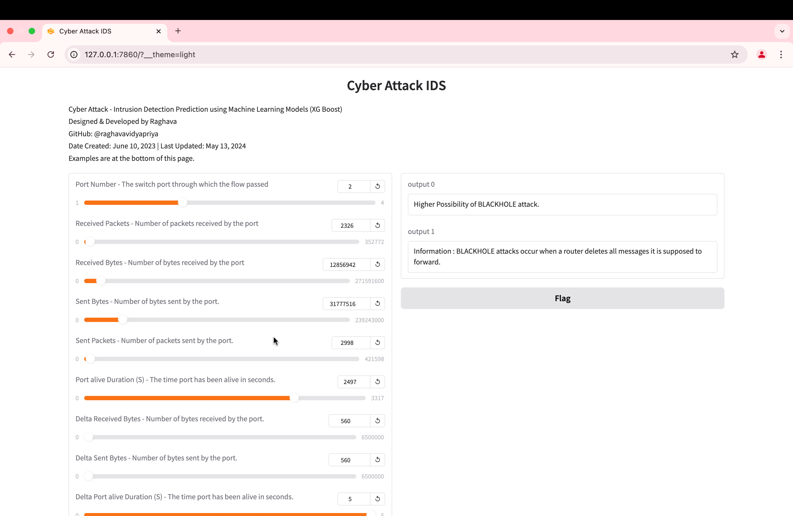

- Prediction Label: TCP-SYN Attack <br><br>
  

- Prediction Label: PORTSCAN Attack <br><br>
  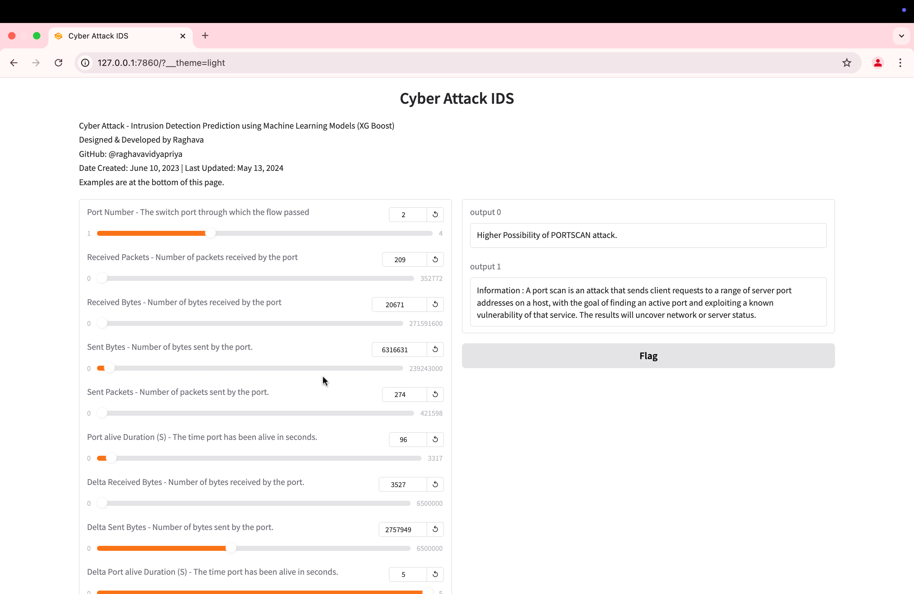

- Prediction Label: DIVERSION Attack <br><br>
  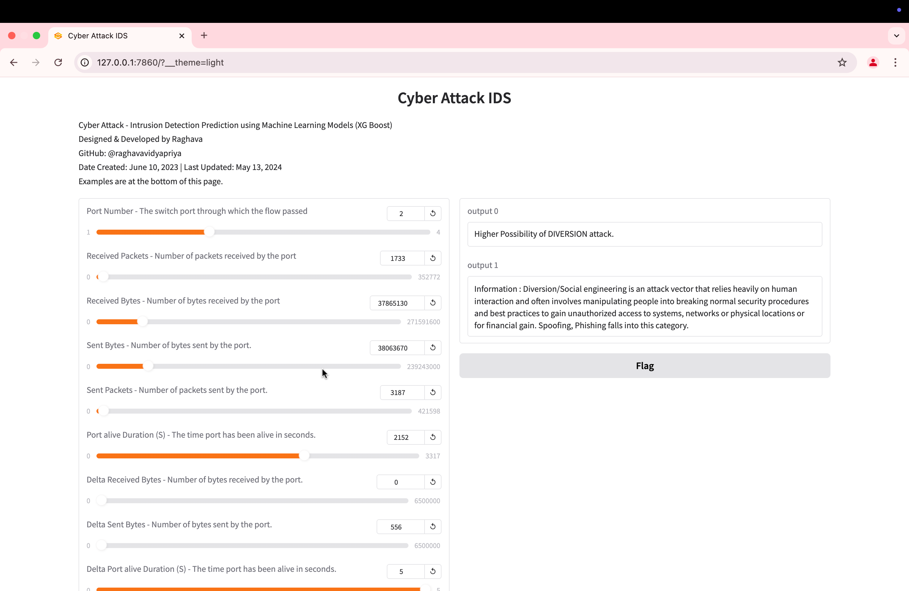

<br><br>

### FUTURE SCOPE

Companies realize the limitations of a standard IDS. Some are reacting to build bigger and better products for their customers. New IDS solutions may come with a lower administrative burden. They may rely on machine learning to lower the risk of false positives, So staff have less to examine every day and vendors may update them simultaneously, So the system always has access to up-to-date information in real time.
<br><br>

_END OF README_
